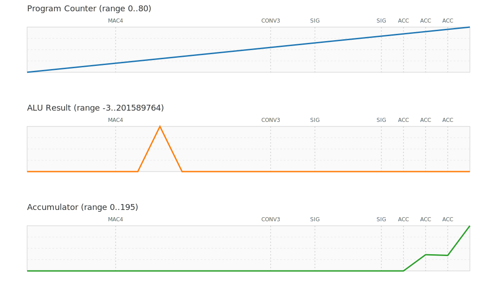
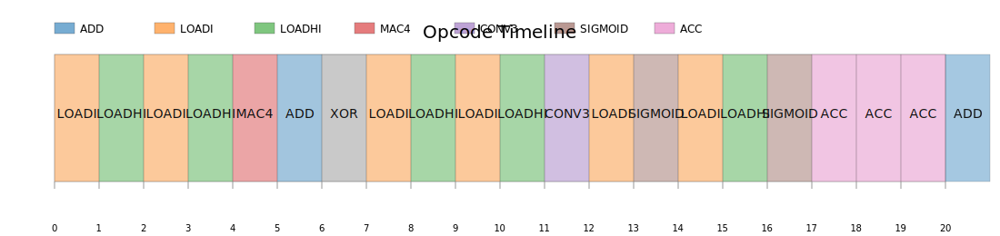

# TinyML RISC CPU

A compact, single-cycle 32-bit RISC core with a custom TinyML-friendly vector MAC instruction. The design is intentionally simple—no pipelines, no caches—so you can read the RTL in a single sitting, yet it still showcases a small hardware acceleration hook for int8 workloads.

## Highlights
- **Single-cycle core**: PC, instruction ROM, decoder, control, register file, and ALU wired in one easy-to-trace datapath.
- **MAC4 instruction**: Treats 32-bit operands as four signed int8 lanes and computes `a0*b0 + a1*b1 + a2*b2 + a3*b3` in one cycle.
- **Parity-protected register file**: Sixteen 32-bit registers, each with a parity bit that’s checked on every read.
- **Ready-to-run testbench**: Produces a cycle-by-cycle trace so you can see the demo program loading vectors, executing MAC4, and writing results back.

## Directory Layout
```
tinyml_risc_cpu/
├── rtl/
│   ├── alu.v                # arithmetic/logic + MAC4 unit
│   ├── control_unit.v       # decode-to-control mapping
│   ├── cpu_top.v            # ties everything together
│   ├── decoder.v            # field extractor
│   ├── instruction_memory.v # small demo program ROM
│   ├── pc.v                 # +4 program counter
│   └── regfile.v            # 16x32b regs with parity
├── tb/
│   └── cpu_tb.v             # verbose simulation harness
├── synth/
│   └── synth.ys             # Yosys script
└── sta/
    └── constraints.sdc      # 100 MHz timing constraint
```

## Building and Running the Testbench
1. Install a Verilog simulator (Icarus Verilog works great).
2. From the repo root:
   ```bash
   iverilog -g2012 -o cpu_tb.out rtl/*.v tb/cpu_tb.v
   vvp cpu_tb.out
   ```
3. The console log prints each cycle, showing the current PC, instruction, ALU result, parity status, and the full register file. When the MAC4 instruction issues, it calls out the dot-product result explicitly.

Expected MAC4 demo: R1 is loaded with `0x04030201`, R2 with `0x08070605`, so the MAC computes `1*5 + 2*6 + 3*7 + 4*8 = 70` and stores `70 (0x46)` in R3.

## Plotting the Run
The testbench emits a `TRACE` line every cycle, making it easy to turn the textual log into visuals:

1. Capture the simulation output:
   ```bash
   cd tinyml_risc_cpu
   iverilog -g2012 -o cpu_tb.out rtl/*.v tb/cpu_tb.v
   vvp cpu_tb.out | tee assets/cpu.log
   ```
2. Convert the trace into SVG plots (pure Python, no extra libraries needed):
   ```bash
   python3 scripts/gen_plots.py
   ```

The script drops three files into `assets/`, ready for documentation:



The waveform panel tracks PC, ALU result, and accumulator in separate bands, with vertical markers calling out when MAC4, CONV3, SIG, or ACC opcodes execute.


Accumulator plot highlights each ACC instruction, annotating the delta applied to the running total.



The opcode timeline shows which operation the CPU executed each cycle (with cycle numbers and a color legend), making it easy to correlate instruction mix with ALU behavior.

## Synthesis
The provided Yosys script targets a generic netlist:
```bash
cd synth
yosys synth.ys
```
That produces `cpu.json` and `cpu_synth.v` for downstream tooling.

## Constraints
`sta/constraints.sdc` defines a single 10 ns clock on `clk`, enough for basic static timing checks or handoff to a backend flow.

## Extending the Core
- Add more opcodes or immediate formats in `decoder.v` and `control_unit.v`.
- Expand the instruction memory or hook up a real memory interface.
- Swap the MAC4 out for other TinyML primitives (e.g., activation functions or accumulators).

Everything is small enough to tinker with quickly—have fun experimenting.
